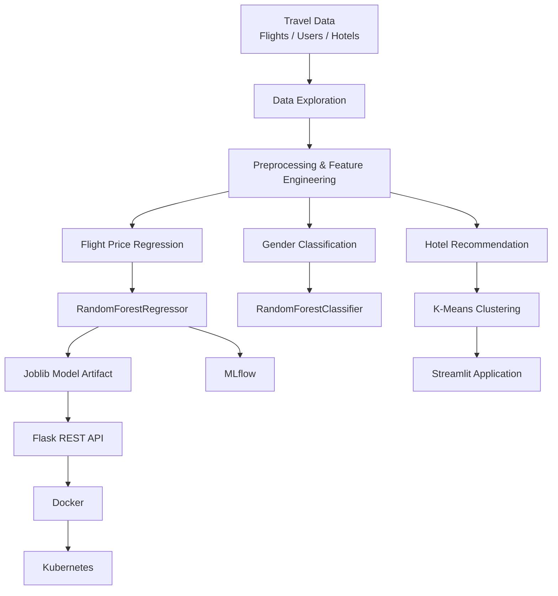

# ✈️ Travel & Tourism — Machine Learning & MLOps

<p align="center">
  <b>An end-to-end Travel & Tourism machine learning project</b><br>
  Flight Price Prediction • Gender Classification • Hotel Recommendation • Flask • Docker • Kubernetes • MLflow • Streamlit
</p>

<p align="center">
  
  
  
  
  
  
  
  
</p>

---

## 📌 Table of Contents

- [Overview](#-overview)
- [Project Objectives](#-project-objectives)
- [System Architecture](#-system-architecture)
- [Datasets](#-datasets)
- [Machine Learning Models](#-machine-learning-models)
  - [Flight Price Prediction](#1-flight-price-prediction)
  - [Gender Classification](#2-gender-classification)
  - [Hotel Recommendation](#3-hotel-recommendation)
- [Model Results](#-model-results)
- [MLOps & Deployment](#-mlops--deployment)
  - [Flask API](#flask-rest-api)
  - [Docker](#docker)
  - [Kubernetes](#kubernetes)
  - [MLflow](#mlflow)
- [Streamlit Application](#-streamlit-application)
- [Project Structure](#-project-structure)
- [Google Colab Setup](#-google-colab-setup)
- [Local Setup](#-local-setup)
- [API Usage](#-api-usage)
- [Kubernetes Deployment](#-kubernetes-deployment)
- [Limitations & Future Improvements](#-limitations--future-improvements)
- [MLOps Extension](#-mlops-extension)
- [Key Learnings](#-key-learnings)

---

## 🚀 Overview

This project applies machine learning and MLOps concepts to the **Travel & Tourism** domain using three connected datasets:

- 👤 **Users**
- ✈️ **Flights**
- 🏨 **Hotels**

The system addresses three different ML use cases:

| Use Case | Type | Model | Main Output |
|---|---|---|---|
| Flight Price Prediction | Regression | Random Forest Regressor | Predicted flight price |
| Gender Classification | Classification | Random Forest Classifier | Predicted gender class |
| Hotel Recommendation | Recommendation / Clustering | K-Means | Recommended hotels |

The project goes beyond model training by implementing model persistence, a Flask REST API, Docker packaging, Kubernetes deployment configuration, MLflow experiment tracking, and a Streamlit recommendation interface.

---

## 🎯 Project Objectives

### Machine Learning
- Build a regression model for flight price prediction.
- Build a classification model for user gender.
- Build a clustering-based hotel recommendation system.
- Evaluate models using appropriate metrics.

### Productionization
- Save trained models using Joblib.
- Serve the regression model through Flask.
- Package the API with Docker.
- Prepare Kubernetes deployment manifests.
- Track experiments and models with MLflow.
- Build a Streamlit interface for hotel recommendations.

---

## 🏗️ System Architecture



> **Tip:** GitHub renders Mermaid diagrams in Markdown, making the architecture directly viewable from the repository.

---

## 📊 Datasets

### ✈️ Flights

The notebook reports:

- **271,888 records**
- **10 original columns**
- No missing values

| Column | Description |
|---|---|
| `travelCode` | Travel identifier |
| `userCode` | User identifier |
| `from` | Origin airport/location |
| `to` | Destination |
| `flightType` | Flight type/class |
| `price` | Flight price — target |
| `time` | Flight duration |
| `distance` | Flight distance |
| `agency` | Flight agency |
| `date` | Flight date |

### 👤 Users

The notebook reports:

- **1,340 records**

| Column | Description |
|---|---|
| `code` | User identifier |
| `company` | Associated company |
| `name` | User name |
| `gender` | Gender |
| `age` | Age |

### 🏨 Hotels

The notebook reports:

- **40,552 records**
- **8 columns**
- No missing values

| Column | Description |
|---|---|
| `travelCode` | Travel identifier |
| `userCode` | User identifier |
| `name` | Hotel name |
| `place` | Hotel location |
| `days` | Number of stay days |
| `price` | Price per day |
| `total` | Total stay price |
| `date` | Booking date |

---

# 🤖 Machine Learning Models

## 1. ✈️ Flight Price Prediction

### Objective

Predict flight prices from historical flight information.

### Feature Engineering

The notebook performs:

**Categorical encoding**
- `from`
- `to`
- `flightType`
- `agency`

using one-hot encoding with `drop_first=True`.

**Date engineering**
- `year`
- `month`
- `day`
- `dayofweek`

**Removed fields**
- `travelCode`
- `userCode`
- `date`

The target variable is:

```text
price
```

### Train/Test Split

```text
80% Training
20% Testing
```

with:

```python
random_state = 42
```

### Model

```python
RandomForestRegressor(random_state=42)
```

### Evaluation

Metrics used:

- MAE
- MSE
- R²

The notebook reports:

| Metric | Reported Result |
|---|---:|
| MAE | `0.00` |
| MSE | `0.00` |
| R² | `1.00` |

> ⚠️ **Important:** The notebook itself flags this near-perfect performance as unusually strong and recommends checking for possible data leakage and validating on unseen data before interpreting it as production-level reliability.

### Visualization

The notebook generates an **Actual vs. Predicted Flight Prices** scatter plot with a perfect prediction line.

---

## 2. 👤 Gender Classification

### Objective

Classify users into gender categories from the available user data.

### Preprocessing

The notebook:

1. Removes `gender = none`.
2. Encodes:
   - `female → 0`
   - `male → 1`
3. Removes:
   - `code`
   - `name`
4. One-hot encodes `company`.
5. Uses the remaining user information for classification.

### Model

```python
RandomForestClassifier(random_state=42)
```

### Evaluation

Metrics:

- Accuracy
- Precision
- Recall
- F1 Score
- Confusion Matrix

### Reported Results

| Metric | Result |
|---|---:|
| Accuracy | `0.47` |
| Precision | `0.55` |
| Recall | `0.41` |
| F1 Score | `0.47` |

The notebook concludes that the current features provide weak predictive power for this classification task.

> ⚠️ In real-world applications, inference involving gender should be handled carefully with appropriate privacy, fairness, and governance considerations.

---

## 3. 🏨 Hotel Recommendation

### Objective

Recommend hotels based on hotel characteristics and user-selected travel preferences.

### Features

The notebook uses:

```text
name
place
days
price
```

### Preprocessing

**Categorical**
- `name`
- `place`

→ One-hot encoding

**Numerical**
- `days`
- `price`

→ StandardScaler

### Model

```python
KMeans(
    n_clusters=5,
    random_state=42
)
```

Each hotel receives a cluster label.

The notebook reports the largest cluster contains:

```text
12,618 hotel records
```

### Recommendation Flow

```text
User Preferences
       ↓
Encode Input
       ↓
Scale Numerical Features
       ↓
Predict K-Means Cluster
       ↓
Filter Hotels
       ↓
Apply Hotel/Destination Preferences
       ↓
Display Recommendations
```

---

# 📈 Model Results

<details>
<summary><b>Click to expand regression results</b></summary>

### Flight Price Regression

```text
MAE = 0.00
MSE = 0.00
R²  = 1.00
```

The result is based on the notebook's reported test evaluation and should be validated further because perfect predictive performance can indicate leakage or a highly deterministic dataset.

</details>

<details>
<summary><b>Click to expand classification results</b></summary>

### Gender Classification

```text
Accuracy  = 0.47
Precision = 0.55
Recall    = 0.41
F1 Score  = 0.47
```

</details>

<details>
<summary><b>Click to expand recommendation details</b></summary>

### Hotel Recommendation

```text
Algorithm: K-Means
Clusters: 5
Largest cluster: 12,618 records
```

</details>

---

# ⚙️ MLOps & Deployment

## Flask REST API

The trained flight price model is exposed through Flask.

### Endpoint

```http
POST /predict
```

### Request

The API receives model-ready feature data as JSON.

Example:

```json
{
  "time": 1.76,
  "distance": 676.53,
  "from_Aracaju (SE)": 0,
  "from_Brasilia (DF)": 0,
  "to_Salvador (BH)": 1
}
```

### Response

```json
{
  "prediction": 1434.38
}
```

### API Port

```text
5000
```

> The notebook explicitly notes that the initial API expects input to match the model's trained feature structure. A production implementation should move preprocessing into the API or load a complete preprocessing pipeline.

---

# 🐳 Docker

The notebook generates:

```text
requirements.txt
Dockerfile
app.py
random_forest_model.pkl
```

### Build

```bash
docker build -t flight-price-predictor .
```

### Run

```bash
docker run -p 5000:5000 flight-price-predictor
```

The Docker image exposes:

```text
5000
```

---

# ☸️ Kubernetes

The project prepares Kubernetes resources for scalable model serving.

### Deployment

```text
Application: flight-price-predictor
Replicas: 3
Container Port: 5000
```

### Service

```text
Type: NodePort
Port: 5000
Target Port: 5000
```

### Deploy

```bash
kubectl apply -f deployment.yaml
kubectl apply -f service.yaml
```

### Verify

```bash
kubectl get deployments
kubectl get pods
kubectl get services
```

Architecture:

```text
             Kubernetes Cluster
                    │
        ┌───────────┼───────────┐
        ▼           ▼           ▼
      Pod 1       Pod 2       Pod 3
        │           │           │
        └───────────┼───────────┘
                    │
              Service :5000
```

---

# 📦 MLflow

MLflow is used for experiment and model tracking.

### Logged information

**Parameters**
```text
random_state = 42
```

**Metrics**
- MAE
- MSE
- R²

**Model**
- Random Forest model artifact

### MLflow Model

The notebook registers:

```text
RandomForestFlightPricePredictor
```

### Start MLflow

```bash
mlflow ui --host 0.0.0.0 --port 5001
```

MLflow is used to track the regression experiment and model version.

---

# 🎨 Streamlit Application

The recommendation system includes a Streamlit web interface.

### User Inputs

The app provides controls for:

- Number of days
- Desired price per night
- Preferred hotel name
- Preferred destination

### Application Workflow

```text
User
 ↓
Streamlit UI
 ↓
Preprocessing
 ↓
K-Means Prediction
 ↓
Hotel Filtering
 ↓
Top Recommendations
```

### Run

```bash
streamlit run streamlit_app.py
```

---

# 📁 Project Structure

```text
travel-mlops-capstone/
│
├── 📓 Untitled29 (1)(1).ipynb
│
├── 📊 flights.csv
├── 👤 users.csv
├── 🏨 hotels.csv
│
├── 🤖 random_forest_model.pkl
│
├── 🧠 kmeans_model.pkl
├── 📏 scaler.pkl
├── 📄 hotel_features_with_clusters.csv
│
├── 🌐 app.py
├── 🎨 streamlit_app.py
│
├── 🐳 Dockerfile
├── 📦 requirements.txt
│
├── ☸️ deployment.yaml
├── 🔌 service.yaml
│
└── 📘 README.md
```

---

# 🧪 Google Colab Setup

The notebook is designed to run in Google Colab.

## 1. Open the notebook

Upload the notebook to:

👉 [Google Colab](https://colab.research.google.com/)

## 2. Upload datasets

Make sure the following files are available:

```text
flights.csv
users.csv
hotels.csv
```

## 3. Run the notebook

Run the cells in order:

```text
Data Loading
    ↓
Data Exploration
    ↓
Preprocessing
    ↓
Feature Engineering
    ↓
Model Training
    ↓
Evaluation
    ↓
Model Saving
    ↓
Flask API
    ↓
Docker
    ↓
Kubernetes
    ↓
MLflow
    ↓
Classification
    ↓
Recommendation
    ↓
Streamlit
```

---

# 💻 Local Setup

## Clone the repository

```bash
git clone https://github.com/<your-username>/<your-repository>.git
cd <your-repository>
```

## Create environment

```bash
python -m venv venv
```

### Windows

```bash
venv\Scripts\activate
```

### Linux / macOS

```bash
source venv/bin/activate
```

## Install dependencies

```bash
pip install -r requirements.txt
```

---

# 🌐 API Usage

Start the Flask application:

```bash
python app.py
```

Then send a POST request:

```bash
curl -X POST http://127.0.0.1:5000/predict \
-H "Content-Type: application/json" \
-d '{
  "time": 1.76,
  "distance": 676.53
}'
```

Or use Postman / Thunder Client.

---

# ☸️ Kubernetes Deployment

After building the Docker image:

```bash
docker build -t flight-price-predictor .
```

Apply Kubernetes resources:

```bash
kubectl apply -f deployment.yaml
kubectl apply -f service.yaml
```

Check the deployment:

```bash
kubectl get pods
kubectl get deployments
kubectl get services
```

---

# ✅ Current Implementation Status

| Component | Status |
|---|:---:|
| Flight Price Regression | ✅ |
| Data Preprocessing | ✅ |
| Feature Engineering | ✅ |
| Regression Evaluation | ✅ |
| Model Persistence | ✅ |
| Flask REST API | ✅ |
| Docker Configuration | ✅ |
| Kubernetes YAML | ✅ |
| MLflow Tracking | ✅ |
| Gender Classification | ✅ |
| Hotel Clustering | ✅ |
| Streamlit Recommendation App | ✅ |
| Apache Airflow DAG | ⚠️ Not implemented in current notebook |
| Jenkins CI/CD Pipeline | ⚠️ Not implemented in current notebook |

> The last two components are part of the broader MLOps capstone scope but are not implemented as complete runnable components in the current notebook.

---

# ⚠️ Limitations

<details>
<summary><b>Flight price model</b></summary>

The reported `R² = 1.00` and zero error metrics are unusually strong. The notebook itself recommends checking for data leakage and validating the approach on unseen data.

</details>

<details>
<summary><b>Flask API</b></summary>

The current API assumes the request follows the model-ready feature structure. Preprocessing should be integrated into the serving pipeline for a stronger production implementation.

</details>

<details>
<summary><b>Gender classification</b></summary>

The current model has relatively weak performance, with an F1 score of `0.47`. Additional meaningful features or alternative modeling approaches would be needed for better predictive performance.

</details>

<details>
<summary><b>Hotel recommendation</b></summary>

The current approach is clustering-based and does not use explicit user ratings, clicks, bookings, or collaborative filtering.

</details>

---

# 🔮 Future Improvements

### Machine Learning
- Cross-validation
- Hyperparameter tuning
- Better feature selection
- Model comparison
- Unseen-data validation
- Model monitoring

### Recommendation
- Collaborative filtering
- Hybrid recommendation
- User history
- Ratings and feedback
- Personalized ranking

### API
- Input validation
- Authentication
- Logging
- Health endpoint
- Preprocessing pipeline
- API documentation

### MLOps

```text
GitHub
   ↓
Jenkins CI/CD
   ↓
Docker Build
   ↓
Container Registry
   ↓
Kubernetes
```

### Automated Training

```text
Apache Airflow
      ↓
Data Processing
      ↓
Model Training
      ↓
Evaluation
      ↓
MLflow
      ↓
Model Registry
      ↓
Deployment
```

---

# 🧠 Key Learnings

This project demonstrates the transition from:

```text
Notebook-Based ML
```

to:

```text
Production-Oriented ML System
```

The lifecycle covered is:

```text
Data
 ↓
EDA
 ↓
Preprocessing
 ↓
Feature Engineering
 ↓
Model Training
 ↓
Evaluation
 ↓
Model Persistence
 ↓
Experiment Tracking
 ↓
API Serving
 ↓
Containerization
 ↓
Scalable Deployment
 ↓
User Application
```

---

# 🛠️ Technology Stack

| Layer | Technology |
|---|---|
| Language | Python |
| Development | Google Colab |
| Data Processing | Pandas |
| Numerical Computing | NumPy |
| ML Framework | Scikit-learn |
| Regression | Random Forest Regressor |
| Classification | Random Forest Classifier |
| Recommendation | K-Means |
| Visualization | Matplotlib / Seaborn |
| Model Persistence | Joblib |
| API | Flask |
| Tracking | MLflow |
| Containerization | Docker |
| Orchestration | Kubernetes |
| UI | Streamlit |

---

# 📚 Project Highlights

✅ Three machine learning use cases in one project  
✅ Flight price regression with feature engineering  
✅ User classification workflow  
✅ Hotel recommendation using clustering  
✅ Flask model serving  
✅ Docker containerization  
✅ Kubernetes deployment configuration  
✅ MLflow experiment and model tracking  
✅ Interactive Streamlit recommendation app  
✅ Google Colab development workflow  

---

## 👨‍💻 Author

**Dhananjay Kumar Sharma**

Master of Computer Applications | Generative AI & Agentic AI

Interested in:

- Data Science
- Machine Learning
- Deep Learning
- Generative AI
- MLOps
- AI Engineering

---

## ⭐ If you find this project useful

Give the repository a ⭐ and feel free to explore, improve, and extend the implementation.

---

## 📄 License

Add your preferred license here, for example:

```text
MIT License
```
